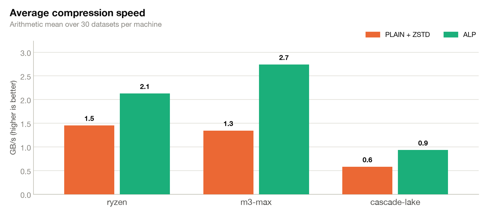
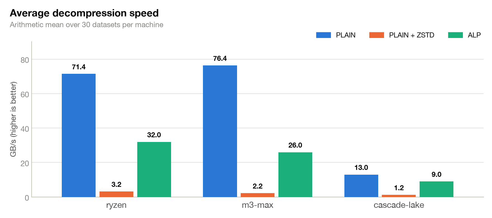
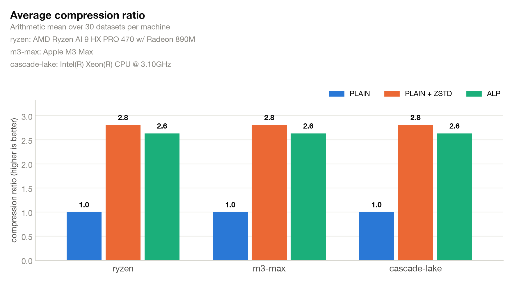
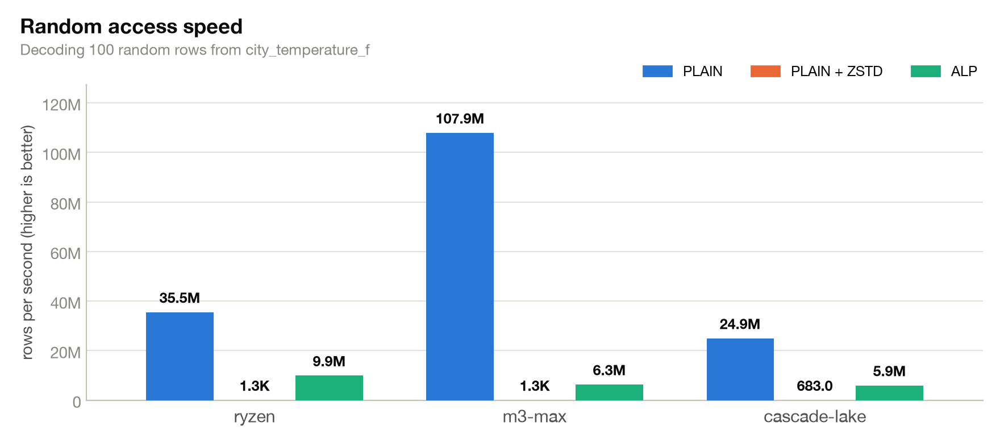

# alp_benchmark
Benchmark to support [ALP: Adaptive Light-weight Floating-point Encoding in Apache Parquet](https://github.com/apache/parquet-site/pull/195) (TODO update link
to real site when published) by [Kosta Tarasov](https://github.com/sdf-jkl), [Andrew Lamb](https://github.com/alamb), [Prateek Gaur](https://github.com/prtkgaur)


This repository contains a benchmark for evaluating the performance of the
Adaptive Lossless Floating Point (ALP) encoding in Apache Parquet (TODO GET RELEVANT LINKS). 

It supports the Parquet Blog Post: 

- Related to https://github.com/apache/parquet-site/issues/175
- Related to https://github.com/apache/parquet-site/pull/195

The benchmark compares different encoding and compression strategies for columns
of 64-bit floating point values.






Prepublishing Checklist
- [ ] Double check the benchmark.rs binary
- [ ] Reproduce the benchmark numbers

# Prerequisites

1. Install Rust
2. Install uvx

# Download Data: 
Run 
```shell
./download_data.sh
```

To download the CWI testing corpus, consisting of 30 `.bin` files contain raw
little-endian IEEE-754 `f64` values with no header. Every eight bytes represent
one value.

# Benchmark
To run:
```shell
./benchmark.sh
```

This will print a textual report. Example reports:
* [kosta](reports/kosta.md)
* [alamb](reports/alamb.md)

## Run on your own Parquet files

The benchmark binary also accepts Parquet files, so you can measure ALP on
your own datasets. Point it at a directory or a single  file:

```shell
cargo run --release --bin benchmark -- /path/to/parquet-files
```

Every top-level `FLOAT` or `DOUBLE` column becomes its own dataset named
`<file>/<column>` and runs the same comparisons as the `.bin` corpus

For the most representative speed numbers, build with
`RUSTFLAGS="-C target-cpu=native"` (as `benchmark.sh` does).

## Diagrams
There is a python script that post-processes the benchmark results and generates diagrams.
It requires [uv](https://docs.astral.sh/uv/), which fetches the dependencies
(matplotlib) automatically — no venv needed.

```shell
# Create diagrams from kosta.md in diagrams/kosta
./diagrams.py reports/kosta.md
```

# Related work

* Andrew Lamb's script updates: https://github.com/apache/arrow-rs/pull/10696
* Kosta's Tarasov's original script to measure ALP performance (see here) https://github.com/apache/parquet-site/pull/195#issuecomment-5223205213


# Dataset Descriptions

TODO (get from blog)

# Other Tools


`bin_to_parquet.sh` converts the raw CWI ALP datasets into one-column Parquet
files. It expects the output directory as its only argument:

```shell
./bin_to_parquet.sh /path/to/parquet-output
```

By default, the script reads `.bin` files recursively from `./data` (populated
by `./benchmark.sh`) and for each input file named `<file>.bin`, the script writes:

```text
<file>.plain.zstd.parquet   # PLAIN encoding with ZSTD compression
<file>.alp.parquet          # ALP encoding without block compression
```


